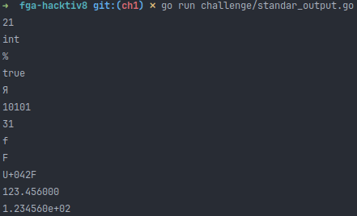
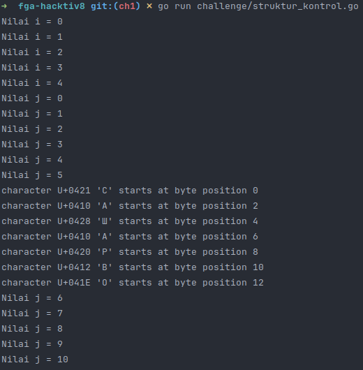
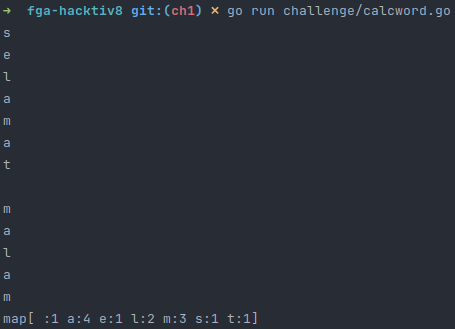
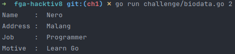
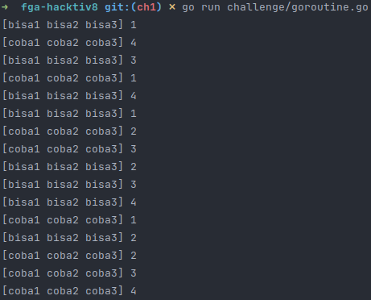

# FGA x Hacktiv8
Chapter 1: Introduction Of Fundamental Go Programming

## Challenges

- [Session 1](#session-1)
- [Session 2](#session-2)
- [Session 3](#session-3)
- [Session 4](#session-4)
- [Session 5](#session-5)

### Session 1

[👨‍💻 Read Code](challenge/standar_output.go)

**Result**  


[👆 Back to Top](#challenges)

### Session 2

**Instruction**

> Buatlah sebuah program go dengan implementasi perulangan for dan kombinasi if-else

[👨‍💻 Read Code](challenge/struktur_kontrol.go)



[👆 Back to Top](#challenges)

### Session 3

**Instruction**
> Buatlah looping dengan variable yang berisi string suatu kalimat dan pecahlah kalimat tersebut menjadi 1 per 1 kataSetelah sudah dipecah lakukan perhitungan munculnya kata dari variable tersebut dengan cara mapping golangContoh Output dapat dilihat pada gambar yang di attach: Input : “selamat malam”

[👨‍💻 Read Code](challenge/calcword.go)



[👆 Back to Top](#challenges)

### Session 4

**Instructions**
> Buatlah sebuah service berupa CLI untuk menampilkan data teman-teman kalian dikelas.Contohnya, ketika kalian menjalankan perintah go run biodata.go 1 maka data yang akan muncul adalah data teman kalian dengan absen no 1. Data yang harus ditampilkan yaitu:
> - Nama
> - Alamat
> - Pekerjaan
> - Alasan memilih kelas Golang

[👨‍💻 Read Code](challenge/biodata.go)

Usage:

```bash
go run challenge/biodata.go 1 # index
```



[👆 Back to Top](#challenges)

### Session 5

**Instructions**
> Buatlah 2 concurrency dengan GOROUTINE dengan 2 data yang berbeda dengan tipe data interface keduanya.Lakukan looping kedua GOROUTINE sebanyak 8 kali dalam total dimana 4 kali looping interface1 dan 4 kali looping interface2 tersebut lalu tampilkan kedua prosesnya menggunakan Println.
> Buatlah 2 kodingan dengan kondisi
> 1. GOROUTINE keduanya menampilkan secara acak
> 2. GOROUTINE keduanya menampilkan secara rapih (gunakan mutex golang dengan fungsi lock, dan unlock)

[👨‍💻 Read Code](challenge/goroutine.go)



[👆 Back to Top](#challenges)
